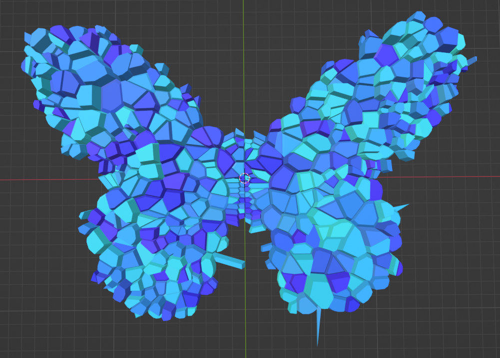

# BlenderVoronoiFromImage
Generate a voronoi or delaunay mesh from a black and white image.  
  
This repository is based on the work by <a href="https://github.com/njanakiev">njanakiev</a>.  
The original repository can be found <a href="https://github.com/njanakiev/blender-scripting/blob/master/scripts/voronoi_landscape.py">here</a>.

# Input

# Delaunay Example

# Voronoi Example
